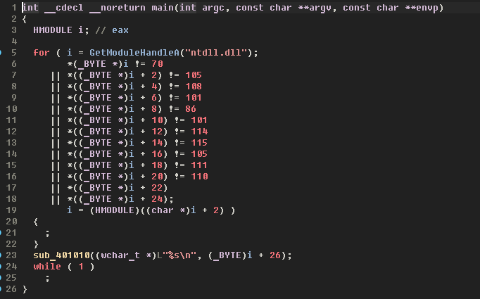
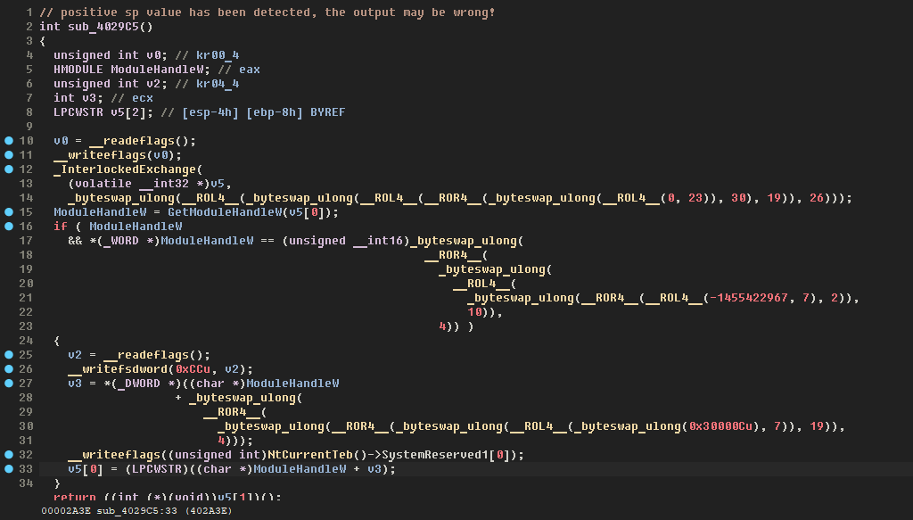

# Milfuscator Free - Portable Executable x86 Mutator

The 'Free Milfuscator' is now an open-source project, the essence of which is to mutate the x32 code by rebuilding the entire PE using the Zydis & AsmJit libraries. The very idea of mutation is taken from one P2C project for CS:GO

The milfuscator completely rebuilds the PE file, modifies and supplements the existing code .text sections thereby expanding it, it does not create any additional sections.

## How to use?

The milfuscator does not read the PDB file, instead you must specify the path to .MAP file, then to the executable file itself. To enable generation .MAP file you have to go to the project settings and perform the following steps:

1. Go to the 'Linker' tab.
2. Click the Debug property page.
3. Modify the Generate Map File property.

After compiling in the console application, first you specify the full path to the executable file, then to the .MAP file.

## Example

```cpp
#include <iostream>
#include <Windows.h>

int main( )
{
    /* The author of this code: DarkBull */

    char * pNative = ( char * ) GetModuleHandleA( "ntdll.dll" );

    while ( true )
    {
        if ( pNative[ 0 ] == 0x46 ) // F    
        {
            if ( pNative[ 2 ] == 0x69 ) // i
            {
                if ( pNative[ 4 ] == 0x6C ) // l
                {
                    if ( pNative[ 6 ] == 0x65 ) // e
                    {
                        if ( pNative[ 8 ] == 0x56 ) // V
                        {
                            if ( pNative[ 10 ] == 0x65 ) // e
                            {
                                if ( pNative[ 12 ] == 0x72 ) // r
                                {
                                    if ( pNative[ 14 ] == 0x73 ) // s
                                    {
                                        if ( pNative[ 16 ] == 0x69 ) // i
                                        {
                                            if ( pNative[ 18 ] == 0x6F ) // o
                                            {
                                                if ( pNative[ 20 ] == 0x6E ) // n
                                                {
                                                    if ( pNative[ 22 ] == 0x00 )
                                                    {
                                                        if ( pNative[ 24 ] == 0x00 )
                                                        {
                                                            wprintf( L"%s\n", pNative + 26 );
                                                            break;
                                                        }
                                                    }
                                                }
                                            }
                                        }
                                    }
                                }
                            }
                        }
                    }
                }
            }
        }
        pNative += 0x02;
    }

    while( true );
}
```
## Before


## After


## Credits

[Zydis](https://github.com/zyantific/zydis)  
[AsmJit](https://github.com/asmjit/asmjit)
